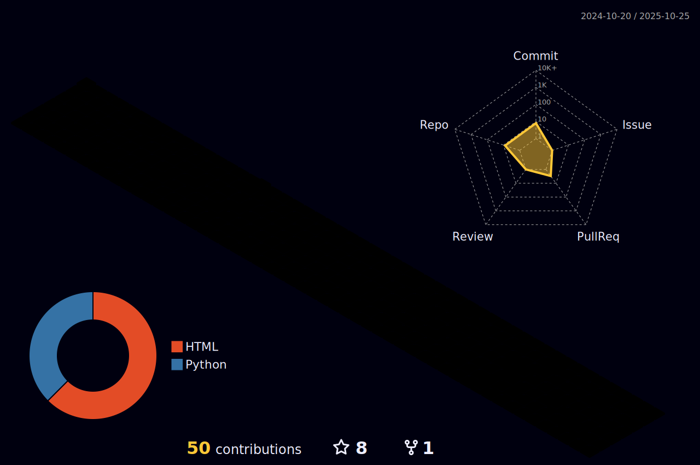

<h1 align="center">Hi , I'm Bao Ho-Trong</h1>

<!--
**htrbao/htrbao** is a ✨ _special_ ✨ repository because its `README.md` (this file) appears on your GitHub profile.

Here are some ideas to get you started:
- 🔭 I’m currently working on ...
- 🌱 I’m currently learning ...
- 👯 I’m looking to collaborate on ...
- 🤔 I’m looking for help with ...
- 💬 Ask me about ...
- 📫 How to reach me: ...
- 😄 Pronouns: ...
- ⚡ Fun fact: ...
-->
<h2>Recent activities</h2>
---

  
  

<h2>Statistic</h2>
---

---

